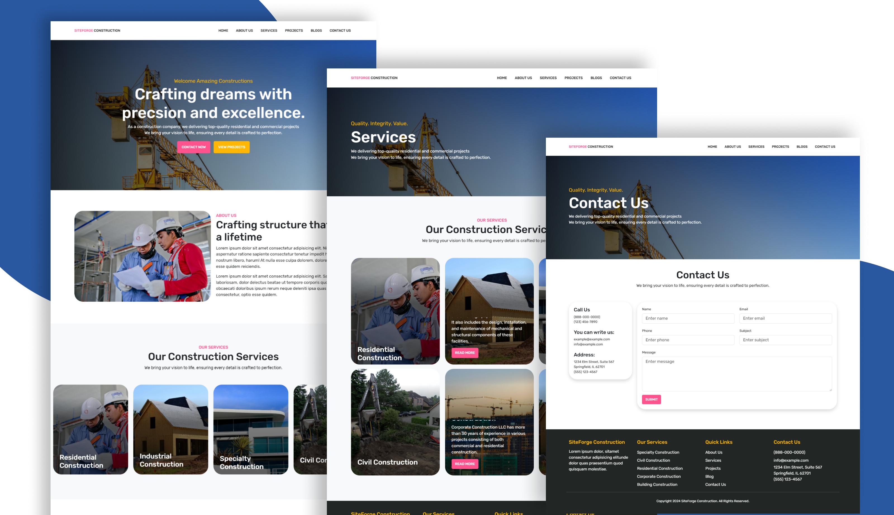

# SiteForge Construction  
<div align="center">

</div>
<br>
SiteForge Construction is a dynamic and responsive website built for streamlining construction-related services. This project combines modern front-end and back-end technologies to deliver a seamless, user-friendly experience tailored to meet the needs of the construction industry.  


## Features  
- **Responsive Design**: Fully optimized for desktops, tablets, and mobile devices.  
- **Dynamic Content**: Smooth integration of real-time updates and interactive elements.  
- **Modern Tech Stack**: React.js for the front-end and Laravel for the back-end to ensure scalability and performance.  
- **Intuitive User Interface**: Designed to provide a hassle-free experience for users navigating the website.  
- **Robust Back-End**: Efficient handling of data and business logic using Laravel.  

## Tech Stack  
- **Front-End**: React.js, HTML5, CSS3, JavaScript  
- **Back-End**: Laravel, PHP  
- **Database**: MySQL  

## Installation  

Follow the steps below to set up the project locally:  

1. **Clone the repository**:  
   ```bash  
   git clone https://github.com/CodeWithMariam/SiteForge-Construction.git  

2. **Navigate to the project directory**:  
   ```bash 
   cd Construction  
3. **Set up the back-end**: 
- Navigate to the Laravel project directory:  
   ```bash 
   cd backend  
- Install dependencies:  
   ```bash 
   composer install  
- Configure the .env file and run migrations:  
   ```bash 
   php artisan migrate  
   php artisan serve  

4. **Set up the front-end**: 
- Navigate to the React project directory:  
   ```bash 
   cd frontend    
- Install dependencies:  
   ```bash 
   npm install    
- Configure the .env file and run migrations:  
   ```bash 
   npm start  
## Usage  
- Navigate to the provided URL after running the local servers.  
- Explore the site to view features and interact with dynamic components.  

## Blogs  
Explore the blogs to gain insights into the project and the technologies used:  

### Most Popular Blogs  
- [Building a Modern Construction Website with React.js and Laravel](https://www.telerik.com/blogs/7-tips-for-building-scalable-react-applications)  
- [How to Build Scalable React Applications](https://www.smashingmagazine.com/2020/06/react-laravel-development-architecture/)  
- [Best Practices for Laravel Development](https://dev.to/laravel/best-practices-for-laravel-development-5jkk)  
- [How to Optimize Your Website's Performance](https://www.sitepoint.com/how-to-optimize-your-websites-performance/)  
- [The Ultimate Guide to UI/UX Design for Web Applications](https://uxdesign.cc/the-ultimate-guide-to-ui-ux-design-for-web-applications-2020-56cfbc49f8fb)  

### Additional Blogs  
- [React vs Vue.js: Which One Should You Choose in 2024](https://medium.com/js-dojo/react-vs-vue-which-one-should-you-choose-in-2024-cf72be54754f)  
- [10 Essential Laravel Tips You Should Know](https://codewall.co.uk/10-essential-laravel-tips-you-should-know/)  
- [Managing State in React: A Comprehensive Guide](https://www.digitalocean.com/community/tutorials/react-managing-state-in-react-a-comprehensive-guide)  

## Contribution  
Contributions are welcome! Feel free to fork the repository, create a feature branch, and submit a pull request.  

## License  
This project is open-source and available under the [MIT License](LICENSE).  

## Contact  
For any inquiries or feedback, feel free to reach out:  
- **Email**: mariamkareem772@gmail.com  
- **GitHub**: [CodeWithMariam](https://github.com/CodeWithMariam)  

Developed with ❤️ by Mariam Kareem
